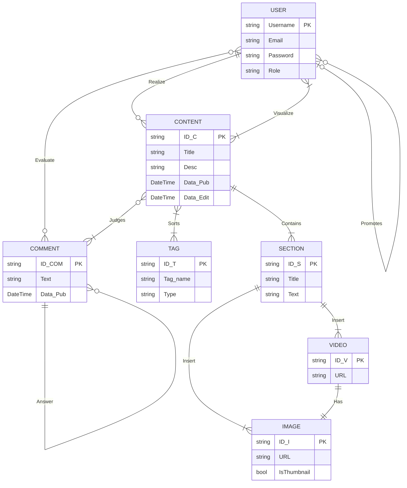

# Diario tecnico (Documentazione Vanitas Studios)
Questo documento analizza le scelte architettoniche e le decisioni di design intraprese per supportare la visione finale dell'applicativo. Il modus operandi adottato mira a gestire consapevolmente il trade-off tra velocità di sviluppo, sicurezza del dato e complessità strutturale.

## 📑 Indice dei Contenuti
1. [Analisi dei Requisiti & Progettazione](#1-analisi-dei-requisiti-&-progettazione)
   - [Requisiti Funzionali](#requisiti-funzionali)
   - [Modellazione del Database](#modellazione-del-database)
   - [Schema Logico](#schema-logico-relational-mapping)
2. [Realizzazione Database (DDL)](#2-realizzazione-database-ddl)
   - [Implementazione SQL](#implementazione-sql)
   - [Note Tecniche & Refactoring](#note-tecniche-&-refactoring)

## 1. Analisi dei Requisiti & Progettazione
Il progetto nasce come ecosistema web per centralizzare la Ricerca & Studio del team. L'obiettivo è fornire uno strumento professionale per documentare il game development e pubblicare case studies di reverse engineering.

### Requisiti Funzionali
- **Gestione Content-Type**: Supporto ibrido per documentazione tecnica (C#, bug fixing) e analisi narrativa/gameplay.

- **Flessibilità Architetturale**: Struttura scalabile per permettere aggiornamenti futuri senza refactoring massivi del database.

- **User Interaction**: Sistema di feedback integrato con supporto a discussioni nidificate (thread).

### Organizzazione dei Dati
- **Tassonomia**: Sistema basato su **Tag** per la categorizzazione granulare.

- **Struttura Modulare**: Contenuti divisi in **Sezioni** per garantire leggibilità e ordine logico.

- **Media Management**: Integrazione di asset visuali con vincoli di integrità (es. ogni video necessita di una thumbnail di supporto).

### Modello di Accesso (RBAC - Role Based Access Control)
Il sistema implementa tre livelli di autorizzazione:

- **Reader (User)**: Accesso in sola lettura e interazione tramite commenti.

- **Editor**: Privilegi di scrittura e pubblicazione contenuti.

- **Administrator**: Gestione completa della tassonomia (tag), moderazione e gestione dei privilegi (Promotion system).

### Modellazione del Database
#### Diagramma E/R (Entity-Relationship)
Il diagramma illustra la logica relazionale. La struttura è progettata per gestire relazioni **Many-to-Many** (es. tra contenuti e tag) e **Self-Referencing** (per il sistema di risposte ai commenti).
> *Nota* : questo mostrato sotto è un esempio, continuare per immagine E/R.



#### Schema Logico (Relational Mapping)
Lo schema riflette la traduzione del diagramma in tabelle fisiche, con focus sull'ottimizzazione delle chiavi e dei legami relazionali.

- **USER** (Username PK, Email, PasswordHash, Role)

- **PROMOTION** (ID_promotion PK, NewEditor FK, Admin FK, Timestamp)

- **CONTENT** (ID_C PK, Type, Title, Description, CreatedAt, UpdatedAt, Author FK)

- **COMMENT** (ID_COM PK, Text, CreatedAt, ParentComment FK, UserID FK, ContentID FK)

- **EVALUATE** (ID_eval PK, Type, CommentID FK, UserID FK)

- **CONTENT_TAGS** (ContentID FK-PK, TagID FK-PK) — Tabella di giunzione per relazione N:M

- **TAG** (ID_T PK, Name, Type)

- **SECTION** (ID_S PK, Title, Body, DisplayOrder, ContentID FK)

- **IMAGE** (ID_I PK, Url, IsThumbnail, SectionID FK)

- **VIDEO** (ID_V PK, Url, SectionID FK, ThumbnailID FK)

> #### Legenda:
> - PK (Primary Key), chiave primaria univoca della tabella.
> - FK (Foreign Key), chiave esterna che punta a un'altra tabella per creare un legame.
> - FK-PK (Composite Primary Key), chiave esterna che fa parte della chiave primaria composta (tipica delle tabelle ponte).

## 2. Realizzazione Database
In questa fase, la struttura logica è stata tradotta in oggetti fisici utilizzando il linguaggio **DDL (Data Definition Language)**. Il database è stato progettato su SQL Server, ottimizzando i tipi di dato per bilanciare performance e integrità.
``` sql
USE VanitasDB;
GO

-- Gestione Utenti con vincoli di integrità e sicurezza base
Create table [User](
	ID_User int PRIMARY KEY IDENTITY(1,1),
	Username varchar(20) NOT NULL UNIQUE, 
	Email varchar(255) NOT NULL UNIQUE, 
	User_Password varbinary(64) NOT NULL, -- Predisposizione per hashing (SHA256/512)
	User_Role varchar(20) NOT NULL DEFAULT 'user',
	CONSTRAINT CK_Email Check(Email LIKE'%@%'),
	CONSTRAINT CK_Role Check(User_Role IN ('user', 'editor', 'admin'))
);
GO

-- Sistema di auditing per le promozioni di ruolo
Create table Promotion(
	ID_Promotion int PRIMARY KEY IDENTITY(1,1),
	Promoted_ID int NOT NULL, 
	Admin_Promoter_ID int NOT NULL,
	Data_Promotion datetime2 NOT NULL DEFAULT GETDATE(),
	CONSTRAINT FK_Promoted_User FOREIGN KEY (Promoted_ID) REFERENCES [User](ID_User),
	CONSTRAINT FK_Admin_Promoter FOREIGN KEY (Admin_Promoter_ID) REFERENCES [User](ID_User)
);
GO

-- Core dei contenuti (Articoli/Documentazione)
Create table Content(
	ID_C int PRIMARY KEY IDENTITY(1,1),
	Type_C varchar(50) NOT NULL DEFAULT 'articolo',
	Title nvarchar(255) NOT NULL,
	Desc_C nvarchar(500) NOT NULL, 
	Data_Pub datetime2(0) NOT NULL DEFAULT GETDATE(),
	Data_Edit datetime2(0),
	Editor_ID int NOT NULL,
	CONSTRAINT CK_Type_C Check ( Type_C IN ('articolo', 'documentazione')),
	CONSTRAINT FK_Editor FOREIGN KEY (Editor_ID) REFERENCES User(ID_User)
);
GO

-- Sistema di commenti con Self-Referencing per risposte nidificate
Create Table Comment(
	ID_Comm int PRIMARY KEY IDENTITY(1,1),
	Comm_Text nvarchar(2000) NOT NULL, 
	Data_Pub datetime2(0) NOT NULL DEFAULT GETDATE(),
	Content_ID int NOT NULL, 
	Comment_User_ID int NOT NULL,
	Answer_ID int NULL, 
	CONSTRAINT FK_Content_ID FOREIGN KEY (Content_ID) REFERENCES Content(ID_C),
	CONSTRAINT FK_Comment_User_ID FOREIGN KEY (Comment_User_ID) REFERENCES [User](ID_User),
	CONSTRAINT FK_Answer_ID FOREIGN KEY (Answer_ID) REFERENCES Comment(ID_Comm)
);
GO

-- Tabella di giunzione per sistema di Like/Evaluate
Create table Evaluate(
	User_Like_ID int NOT NULL,
	Comm_Like_ID int NOT NULL,
	isLike bit NOT NULL,
	PRIMARY KEY(User_Like_ID, Comm_Like_ID),
	CONSTRAINT FK_User_Like_ID FOREIGN KEY (User_Like_ID) REFERENCES [User](ID_User),
	CONSTRAINT FK_Comm_Like_ID FOREIGN KEY (Comm_Like_ID) REFERENCES Comment(ID_Comm)
);
GO

-- Tassonomia (Tags)
Create table Tag(
	ID_T int PRIMARY KEY IDENTITY(1,1),
	Tag_Name varchar(50) NOT NULL, 
	Type_T varchar(50) NOT NULL DEFAULT 'articolo'
	CONSTRAINT CK_Type_T Check(Type_t in ('articolo', 'documentazione'))
);
GO

-- Relazione Many-to-Many tra Content e Tag
Create table Content_Tags(
	Content_Ord_ID int NOT NULL,
	Tag_Ord_ID int NOT NULL,
	PRIMARY KEY(Content_Ord_ID, Tag_Ord_ID),
	CONSTRAINT FK_Content_Ord_ID FOREIGN KEY (Content_Ord_ID) REFERENCES Content(ID_C),
	CONSTRAINT FK_Tag_Ord_ID FOREIGN KEY (Tag_Ord_ID) REFERENCES Tag(ID_T)
);
GO

-- Struttura modulare dei contenuti (Sezioni)
Create table Section(
	ID_S int PRIMARY KEY IDENTITY(1,1),
	Title nvarchar(250) NOT NULL, 
	Section_Text nvarchar(max) NOT NULL,
	Order_num int NOT NULL, 
	Content_S_ID int NOT NULL,
	CONSTRAINT FK_Content_S_ID FOREIGN KEY (Content_S_ID) REFERENCES Content(ID_C) ON DELETE CASCADE
);
GO

-- Gestione Asset Visuali
Create table [Image](
	ID_I int PRIMARY KEY IDENTITY(1,1),
	Image_Url varchar(255) NOT NULL,
	Is_Thumbnail bit NOT NULL DEFAULT 0,
	Section_Image_ID int NOT NULL, 
	CONSTRAINT FK_Section_Image_ID FOREIGN KEY (Section_Image_ID) REFERENCES Section(ID_S)
);
GO

Create table [Video](
	ID_V int PRIMARY KEY IDENTITY(1,1),
	Video_Url varchar(255) NOT NULL,
	Section_Video_ID int NOT NULL,
	Image_Video_ID int NOT NULL UNIQUE,
	CONSTRAINT FK_Image_Video_ID FOREIGN KEY (Image_Video_ID) REFERENCES [Image](ID_I),
	CONSTRAINT FK_Section_Video_ID FOREIGN KEY (Section_Video_ID) REFERENCES Section(ID_S)
);
GO
```
#### Note Tecniche & Refactoring
Durante la fase di implementazione, sono stati adottati i seguenti accorgimenti tecnici:

- **Surrogate Keys**: Utilizzo di chiavi primarie intere con IDENTITY(1,1) per garantire performance ottimali nelle operazioni di JOIN.

- **Data Integrity**: Implementazione di vincoli CHECK a livello DB per garantire che i domini dei dati (es. Ruoli o Tipologie) siano rispettati nativamente.

- **Referential Integrity**: Utilizzo di ON DELETE CASCADE sulla tabella Section per garantire la pulizia automatica degli asset orfani alla cancellazione di un contenuto.

- **Bespoke Naming Convention**: Passaggio a nomi di attributi più descrittivi per migliorare la leggibilità del codice C# post-scaffolding.

> *Avviso*: Sebbene il database implementi vincoli di validità, la logica di business e la sanificazione dei dati (Input Validation) restano delegate al layer applicativo in C#.
