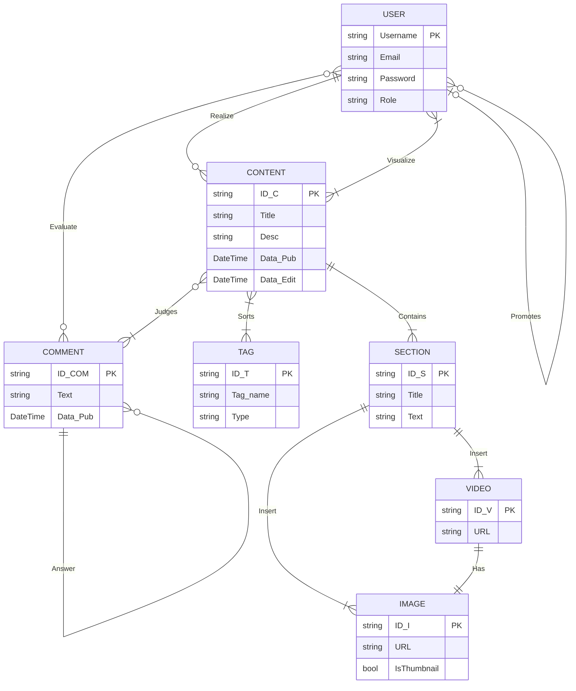

# Diario tecnico (Documentazione Vanitas Studios)
Questo documento analizza le scelte architettoniche e le decisioni di design intraprese per supportare la visione finale dell'applicativo. Il modus operandi adottato mira a gestire consapevolmente il trade-off tra velocità di sviluppo, sicurezza del dato e complessità strutturale.

## 📑 Indice dei Contenuti
1. [Analisi dei Requisiti & Progettazione](#1-analisi-dei-requisiti--progettazione)
   - [Requisiti Funzionali](#requisiti-funzionali)
   - [Modellazione del Database](#modellazione-del-database)
   - [Schema Logico](#schema-logico-relational-mapping)
2. [Realizzazione Database (DDL)](#2-realizzazione-database-ddl)
   - [Implementazione SQL](#implementazione-sql)
   - [Note Tecniche & Refactoring](#note-tecniche--refactoring)
3. [Progettazione Interfaccia e User Experience (UX/UI)](#3-progettazione-interfaccia-e-user-experience-ux-ui)
   - [Stack Tecnologico e Architettura Frontend](#stack-tecnologico-e-architettura-frontend)
   - [Principi di progettazione (Design Principles)](#principi-di-progettazione-e-workflow-creativo)
   - [Case Study: Landing Page (Index)](#case-study-landing-page-index)
4. [Editor Page](#4-editor-page--content-management-workflow-in-progress)
   - [Funzionalità implementate](#funzionalità-implementate-punti-realizzati)
   - [Roadmap dello Sviluppo](#roadmap-dello-sviluppo-cosa-manca)
5. [Rianalisi dei Requisiti](#rianalisi-dei-requisiti--refactoring-del-database)
   - [Note Tecniche](note-tecniche--ottimizzazione-server-side)

## 1. Analisi dei Requisiti & Progettazione
Il progetto nasce come ecosistema web per centralizzare la Ricerca & Studio del team. L'obiettivo è fornire uno strumento professionale per documentare il game development e pubblicare case studies di reverse engineering.

### Requisiti Funzionali
- **Gestione Content-Type**: Supporto ibrido per documentazione tecnica (C#, bug fixing) e analisi narrativa/gameplay.

- **Flessibilità Architetturale**: Struttura scalabile per permettere aggiornamenti futuri senza refactoring massivi del database.

- **User Interaction**: Sistema di feedback integrato con supporto a discussioni nidificate (thread).

### Organizzazione dei Dati
- **Tassonomia**: Sistema basato su **Tag** per la categorizzazione granulare.

- **Struttura Modulare**: Contenuti divisi in **Sezioni** per garantire leggibilità e ordine logico.

- **Media Management**: Integrazione di asset visuali con vincoli di integrità (es. ogni video necessita di una thumbnail di supporto).

### Modello di Accesso (RBAC - Role Based Access Control)
Il sistema implementa tre livelli di autorizzazione:

- **Reader (User)**: Accesso in sola lettura e interazione tramite commenti.

- **Editor**: Privilegi di scrittura e pubblicazione contenuti.

- **Administrator**: Gestione completa della tassonomia (tag), moderazione e gestione dei privilegi (Promotion system).

### Modellazione del Database
#### Diagramma E/R (Entity-Relationship)
Il diagramma illustra la logica relazionale. La struttura è progettata per gestire relazioni **Many-to-Many** (es. tra contenuti e tag) e **Self-Referencing** (per il sistema di risposte ai commenti).
> *Nota* : questo mostrato sotto è un esempio, continuare per immagine E/R.



#### Schema Logico (Relational Mapping)
Lo schema riflette la traduzione del diagramma in tabelle fisiche, con focus sull'ottimizzazione delle chiavi e dei legami relazionali.

- **USER** (Username PK, Email, PasswordHash, Role)

- **PROMOTION** (ID_promotion PK, NewEditor FK, Admin FK, Timestamp)

- **CONTENT** (ID_C PK, Type, Title, Description, CreatedAt, UpdatedAt, Author FK)

- **COMMENT** (ID_COM PK, Text, CreatedAt, ParentComment FK, UserID FK, ContentID FK)

- **EVALUATE** (ID_eval PK, Type, CommentID FK, UserID FK)

- **CONTENT_TAGS** (ContentID FK-PK, TagID FK-PK) — Tabella di giunzione per relazione N:M

- **TAG** (ID_T PK, Name, Type)

- **SECTION** (ID_S PK, Title, Body, DisplayOrder, ContentID FK)

- **IMAGE** (ID_I PK, Url, IsThumbnail, SectionID FK)

- **VIDEO** (ID_V PK, Url, SectionID FK, ThumbnailID FK)

> #### Legenda:
> - PK (Primary Key), chiave primaria univoca della tabella.
> - FK (Foreign Key), chiave esterna che punta a un'altra tabella per creare un legame.
> - FK-PK (Composite Primary Key), chiave esterna che fa parte della chiave primaria composta (tipica delle tabelle ponte).

## 2. Realizzazione Database
In questa fase, la struttura logica è stata tradotta in oggetti fisici utilizzando il linguaggio **DDL (Data Definition Language)**. Il database è stato progettato su SQL Server, ottimizzando i tipi di dato per bilanciare performance e integrità.
``` sql
USE VanitasDB;
GO

-- Gestione Utenti con vincoli di integrità e sicurezza base
Create table [User](
	ID_User int PRIMARY KEY IDENTITY(1,1),
	Username varchar(20) NOT NULL UNIQUE, 
	Email varchar(255) NOT NULL UNIQUE, 
	User_Password varbinary(64) NOT NULL, -- Predisposizione per hashing (SHA256/512)
	User_Role varchar(20) NOT NULL DEFAULT 'user',
	CONSTRAINT CK_Email Check(Email LIKE'%@%'),
	CONSTRAINT CK_Role Check(User_Role IN ('user', 'editor', 'admin'))
);
GO

-- Sistema di auditing per le promozioni di ruolo
Create table Promotion(
	ID_Promotion int PRIMARY KEY IDENTITY(1,1),
	Promoted_ID int NOT NULL, 
	Admin_Promoter_ID int NOT NULL,
	Data_Promotion datetime2 NOT NULL DEFAULT GETDATE(),
	CONSTRAINT FK_Promoted_User FOREIGN KEY (Promoted_ID) REFERENCES [User](ID_User),
	CONSTRAINT FK_Admin_Promoter FOREIGN KEY (Admin_Promoter_ID) REFERENCES [User](ID_User)
);
GO

-- Core dei contenuti (Articoli/Documentazione)
Create table Content(
	ID_C int PRIMARY KEY IDENTITY(1,1),
	Type_C varchar(50) NOT NULL DEFAULT 'articolo',
	Title nvarchar(255) NOT NULL,
	Desc_C nvarchar(500) NOT NULL, 
	Data_Pub datetime2(0) NOT NULL DEFAULT GETDATE(),
	Data_Edit datetime2(0),
	Editor_ID int NOT NULL,
	CONSTRAINT CK_Type_C Check ( Type_C IN ('articolo', 'documentazione')),
	CONSTRAINT FK_Editor FOREIGN KEY (Editor_ID) REFERENCES User(ID_User)
);
GO

-- Sistema di commenti con Self-Referencing per risposte nidificate
Create Table Comment(
	ID_Comm int PRIMARY KEY IDENTITY(1,1),
	Comm_Text nvarchar(2000) NOT NULL, 
	Data_Pub datetime2(0) NOT NULL DEFAULT GETDATE(),
	Content_ID int NOT NULL, 
	Comment_User_ID int NOT NULL,
	Answer_ID int NULL, 
	CONSTRAINT FK_Content_ID FOREIGN KEY (Content_ID) REFERENCES Content(ID_C),
	CONSTRAINT FK_Comment_User_ID FOREIGN KEY (Comment_User_ID) REFERENCES [User](ID_User),
	CONSTRAINT FK_Answer_ID FOREIGN KEY (Answer_ID) REFERENCES Comment(ID_Comm)
);
GO

-- Tabella di giunzione per sistema di Like/Evaluate
Create table Evaluate(
	User_Like_ID int NOT NULL,
	Comm_Like_ID int NOT NULL,
	isLike bit NOT NULL,
	PRIMARY KEY(User_Like_ID, Comm_Like_ID),
	CONSTRAINT FK_User_Like_ID FOREIGN KEY (User_Like_ID) REFERENCES [User](ID_User),
	CONSTRAINT FK_Comm_Like_ID FOREIGN KEY (Comm_Like_ID) REFERENCES Comment(ID_Comm)
);
GO

-- Tassonomia (Tags)
Create table Tag(
	ID_T int PRIMARY KEY IDENTITY(1,1),
	Tag_Name varchar(50) NOT NULL, 
	Type_T varchar(50) NOT NULL DEFAULT 'articolo'
	CONSTRAINT CK_Type_T Check(Type_t in ('articolo', 'documentazione'))
);
GO

-- Relazione Many-to-Many tra Content e Tag
Create table Content_Tags(
	Content_Ord_ID int NOT NULL,
	Tag_Ord_ID int NOT NULL,
	PRIMARY KEY(Content_Ord_ID, Tag_Ord_ID),
	CONSTRAINT FK_Content_Ord_ID FOREIGN KEY (Content_Ord_ID) REFERENCES Content(ID_C),
	CONSTRAINT FK_Tag_Ord_ID FOREIGN KEY (Tag_Ord_ID) REFERENCES Tag(ID_T)
);
GO

-- Struttura modulare dei contenuti (Sezioni)
Create table Section(
	ID_S int PRIMARY KEY IDENTITY(1,1),
	Title nvarchar(250) NOT NULL, 
	Section_Text nvarchar(max) NOT NULL,
	Order_num int NOT NULL, 
	Content_S_ID int NOT NULL,
	CONSTRAINT FK_Content_S_ID FOREIGN KEY (Content_S_ID) REFERENCES Content(ID_C) ON DELETE CASCADE
);
GO

-- Gestione Asset Visuali
Create table [Image](
	ID_I int PRIMARY KEY IDENTITY(1,1),
	Image_Url varchar(255) NOT NULL,
	Is_Thumbnail bit NOT NULL DEFAULT 0,
	Section_Image_ID int NOT NULL, 
	CONSTRAINT FK_Section_Image_ID FOREIGN KEY (Section_Image_ID) REFERENCES Section(ID_S)
);
GO

Create table [Video](
	ID_V int PRIMARY KEY IDENTITY(1,1),
	Video_Url varchar(255) NOT NULL,
	Section_Video_ID int NOT NULL,
	Image_Video_ID int NOT NULL UNIQUE,
	CONSTRAINT FK_Image_Video_ID FOREIGN KEY (Image_Video_ID) REFERENCES [Image](ID_I),
	CONSTRAINT FK_Section_Video_ID FOREIGN KEY (Section_Video_ID) REFERENCES Section(ID_S)
);
GO
```
#### Note Tecniche & Refactoring
Durante la fase di implementazione, sono stati adottati i seguenti accorgimenti tecnici:

- **Surrogate Keys**: Utilizzo di chiavi primarie intere con IDENTITY(1,1) per garantire performance ottimali nelle operazioni di JOIN.

- **Data Integrity**: Implementazione di vincoli CHECK a livello DB per garantire che i domini dei dati (es. Ruoli o Tipologie) siano rispettati nativamente.

- **Referential Integrity**: Utilizzo di ON DELETE CASCADE sulla tabella Section per garantire la pulizia automatica degli asset orfani alla cancellazione di un contenuto.

- **Bespoke Naming Convention**: Passaggio a nomi di attributi più descrittivi per migliorare la leggibilità del codice C# post-scaffolding.

> *Avviso*: Sebbene il database implementi vincoli di validità, la logica di business e la sanificazione dei dati (Input Validation) restano delegate al layer applicativo in C#.

## 3. Progettazione Interfaccia e User Experience (UX/UI)
In questa fase, l'obiettivo è stato tradurre i requisiti funzionali in un'esperienza visiva coerente con il Design del Silenzio. L'approccio adottato è minimalista: eliminare il superfluo per dare peso a ogni singolo elemento architettonico e testuale.

### Stack Tecnologico e Architettura Frontend

- **Razor Pages (.NET Core)**: Utilizzate per garantire una gestione robusta del routing e una perfetta integrazione con la logica backend in C#.

- **Bootstrap 5 (Layout Base)**: Adottato per accelerare lo sviluppo della griglia responsive, permettendo un approccio **Mobile-First** nativo.

- **Custom CSS & Identity Design**: Sovrascrittura dei componenti standard per riflettere l'identità visiva dark e asimmetrica di Vanitas Studios.

### Principi di Progettazione e Workflow Creativo
Il processo di creazione dell'interfaccia segue un protocollo rigoroso basato su standard di design industriale:

- **Ideazione Analogica (Paper at Hand)**: Ogni layout nasce su carta. Questo permette una sintesi rapida delle forme e una selezione critica delle bozze, focalizzandosi sull'atmosfera prima che sul codice.

- **Scala di Grigi (Black & White First)**: Il design viene testato inizialmente in assenza di colore. Questo garantisce che la gerarchia visiva e i contrasti siano efficaci indipendentemente dalla palette cromatica finale.

- **Design of Silence (Negative Space)**: Utilizzo strategico dello spazio "vuoto" per permettere agli elementi di respirare. Nel progetto Vanitas, lo spazio bianco (o nero) è un elemento narrativo che guida lo sguardo dell'utente verso la verità oggettiva dei contenuti.

- **Visual Consistency**: Scelta di uno stile artistico unitario applicato a ogni componente, garantendo che l'interfaccia comunichi un messaggio univoco e professionale.

### Case Study: Landing Page (Index)
La Index rappresenta il punto d'ingresso nell'ecosistema Vanitas. È stata progettata per bilanciare le convenzioni di navigazione a cui l'utente è abituato con un impatto visivo distintivo.
#### 1. Schizzo su carta (Low Fidelity Wireframe)
Il primo passo per visualizzare l'architettura delle informazioni. In questa fase si decide la gerarchia degli elementi (Menu, Hero Section, CTA).


> *Figura 1.0: Bozza analogica iniziale della Landing page*

#### 2. Prototipo Digitale
Trasposizione dello schizzo in ambiente digitale. Qui si definisce la griglia (usando Photoshop) per gestire i volumi, gli allineamenti e il responsive design.


> *Figura 1.1: Wireframe digitale e studio della griglia resposive*

#### 3. Implementazione finale (Live Setup)
Il risultato finale nel browser, con l'integrazione di stili dark, typography e la logica di navigazione base.


> *Figura 1.2: Screenshot dell'interfaccia implementata nel browser*

##### ⚠️ Nota Tecnica sulla Resa Cromatica (Black Level Management):
Durante i test su diversi dispositivi, è emersa una discrepanza nella resa della profondità del nero. A seconda della calibrazione del display (OLED vs LCD), il contrasto tra il soggetto (la statua) e lo sfondo può variare, causando talvolta un risalto eccessivo del soggetto rispetto all'atmosfera "immersiva" ricercata.

Soluzione Futura: Per le prossime iterazioni di design, è prevista l'introduzione di varianti di grigio e l'uso di gradienti dinamici o texture sottili. Questo garantirà una coerenza visiva maggiore tra i vari pannelli, evitando il fenomeno dei "neri schiacciati" e mantenendo il focus sul Design del Silenzio indipendentemente dall'hardware dell'utente.

> **Nota sull'Evoluzione del Design**: Sebbene l'attuale prototipo segua una struttura asimmetrica per gli asset grafici e i titoli, le iterazioni future prevedono l'integrazione della **Sezione Aurea (Golden Ratio)** e della **Psicologia della Gestalt (Design)** per una distribuzione ancora più rigorosa e armoniosa dei volumi.

Current Status: La pagina funge da prototipo per il testing della logica di navigazione e della UX. 

## 4. Editor Page & Content Management Workflow (In Progress)
Lo sviluppo dell'Editor rappresenta la sfida tecnica più significativa del progetto. L'obiettivo è creare uno strumento che permetta la creazione di contenuti complessi (Articoli e Documentazione) mantenendo il rigore estetico del Design del Silenzio.
#### Obiettivi della Progettazione
A differenza di un semplice campo di testo, l'editor di Vanitas Studios è concepito come un compositore modulare. Ogni articolo è visto come un insieme di sezioni dinamiche che l'utente può manipolare individualmente.

### Funzionalità implementate (Punti realizzati)
Allo stato attuale, il modulo editor dispone delle seguenti fondamenta logiche e tecniche:

* **Architettura modulare e ricorsiva**: Ogni sezione è concepita come una struttura gerarchica. Per gestire questa complessità, ho implementato una **funzione ricorsiva** che itera gli elementi in base alla relazione "padre-figlio", permettendo una nidificazione dei contenuti teoricamente infinita e una gestione pulita dell'ordinamento.
* **Blocchi atomici**: I titoli e i media vengono trattati come componenti rigide. Questo garantisce che l'editor non possa "rompere" accidentalmente il layout, mantenendo la coerenza visiva e la pulizia del **Design del Silenzio**.
* **Outline Dinamico (Indice Struttura)**: Per migliorare la UX dell'autore, ho inserito un indice laterale che permette il monitoraggio costante della struttura. Include funzionalità di **Drag & Drop** per il riordinamento rapido e link interni per il salto rapido tra le sezioni (Focus-driven UI).
* **Data Mapping Strutturato**: Predisposizione dei modelli C# per accogliere una collezione di sezioni (`List<Section>`), garantendo l'integrità dell'attributo `Order_num` durante la persistenza sul database.
* **Auto-save & Drafts**: Implementazione di una logica di salvataggio asincrono per prevenire la perdita di dati, separando lo stato di "Bozza" da quello di "Pubblicazione".
  
### Roadmap dello Sviluppo (Cosa Manca)
Per completare l'editor e renderlo un tool di produzione professionale, sono in fase di sviluppo i seguenti moduli:
- **Raffinazione della logica**: affinare i metodi e le funzioni per definire una maggiore sicurezza e resilienza del dato.
- **Sistema di Tagging Dinamico**: Interfaccia per la selezione e creazione di Tag in tempo reale durante la stesura (collegamento con la tabella di giunzione Content_Tags).
- **Live Preview Engine**: Un sistema di anteprima istantanea che permette all'editor di vedere esattamente come apparirà l'articolo (rispetto dei volumi, della tipografia e del nero) prima del salvataggio definitivo.
- **UI/UX Responsive**: L'interfaccia dell'editor deve seguire i principi di design del resto del sito, garantendo che la dashboard di scrittura sia pulita e priva di distrazioni.
  
### L'impatto sulla Struttura Dati
È stato proprio durante la scrittura del codice per il caricamento delle sezioni che è emersa la necessità di una Rianalisi del Database. La gestione delle relazioni uno-a-molti tra Section e Image/Video ha richiesto un affinamento dei vincoli di integrità che non era stato previsto inizialmente nello schema logico.

## 5. Rianalisi dei Requisiti & Refactoring del Database
Durante lo sviluppo del modulo Editor e della logica di gestione dei contenuti, è emersa la necessità di evolvere lo schema iniziale. Invece di procedere a modifiche immediate, è stato scelto un approccio di progettazione critica, identificando i cambiamenti necessari per supportare funzionalità avanzate.

### 🔄 Modifiche all'Architettura dei Dati
### 1. Gestione del Ciclo di Vita (Status & Soft Delete):

- Per evitare la perdita accidentale di dati, la tabella `Content` necessita di un attributo `Status` (Bozza, Pubblicato, Cestinato).

- Implementazione del **Soft Delete**: aggiunta dell'attributo `Eliminated_At`. I contenuti eliminati non verranno rimossi fisicamente dal DB per 30 giorni, permettendo il ripristino.

### 2. Unificazione degli Asset (Tabella Media):

- Semplificazione della struttura: passaggio da tabelle separate (`Image`, `Video`) a una tabella generica `Media`.

- Gestione ibrida: la tabella ospiterà sia URL esterni (es. YouTube per i video) sia percorsi fisici per le immagini.

- Attributo `IsThumbnail` (Boolean) per identificare la copertina del contenuto direttamente nell'asset.

### 3. Semplificazione della Tassonomia:

- Rimozione dell'attributo `Type_T` nella tabella `Tag`. La pratica di sviluppo ha dimostrato che la distinzione dei tag in base al tipo di contenuto era ridondante, favorendo un sistema di tagging universale e più flessibile.

### 4. Ordinamento Dinamico Media:

- Introduzione di un attributo di ordinamento per le immagini all'interno delle sezioni. La logica di posizionamento non sarà calcolata al caricamento (upload), ma consolidata solo durante il salvataggio della bozza o la pubblicazione definitiva.

### 🛠️ Note Tecniche & Ottimizzazione Server-Side
Oltre alla struttura dati, sono stati definiti protocolli per la gestione efficiente delle risorse:

- **Deduplicazione tramite Hashing**: Le immagini caricate verranno identificate tramite un hash univoco. Se un utente carica un'immagine già presente sul server, il sistema punterà al file esistente incrementando un contatore di utilizzi, risparmiando spazio su disco.

- **Garbage Collection dei Media**: Per prevenire la cancellazione di asset durante operazioni fallite o perdite di connessione, le immagini con contatore a zero non verranno eliminate istantaneamente. È previsto un processo di pulizia (Background Task) eseguito in orari di basso traffico (es. alle 00:00) per verificare la persistenza degli orfani.
